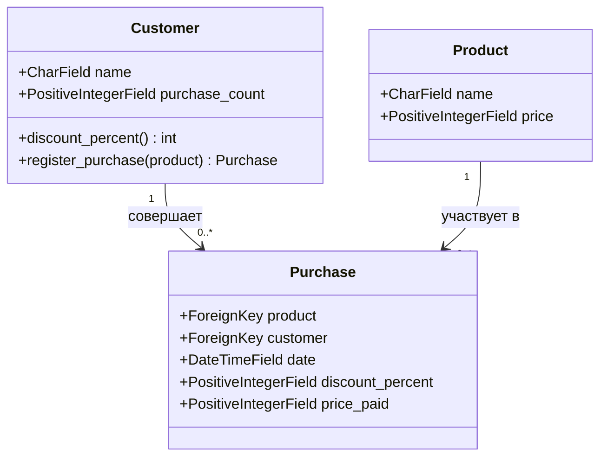
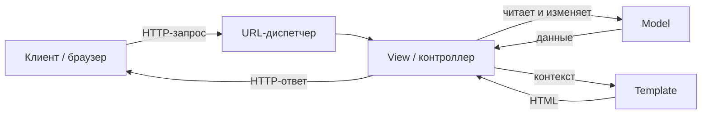

# Лабораторная работа 2. Изучение фреймворка MVC

**Дисциплина:** Технологии программирования и инструментальные средства разработки систем ИИ  
**Вариант:** 4 - Магазин товаров для быта  
**Автор:** Болотов Александр Александрович

## Постановка задачи

Разработать веб-приложение интернет-магазина с использованием фреймворка, реализующего архитектурный шаблон MVC. По варианту 4 магазин торгует товарами для быта и должен:

- вести учёт покупателей;
- начислять каждому покупателю накопительную скидку, размер которой зависит от количества ранее совершённых покупок (любых товаров).

### Правило накопительной скидки

| Количество предыдущих покупок | Скидка |
|---|---|
| 0 - 4 | 0 % |
| 5 - 9 | 5 % |
| 10 - 19 | 10 % |
| 20 и более | 15 % |

Скидка применяется к цене товара в момент покупки и фиксируется в истории покупок.

## Описание решения

Приложение построено на Django и следует шаблону MVC (в терминологии Django - MTV):

- **Model (модель).** `shop/models.py`: `Product`, `Customer`, `Purchase`. Бизнес-логика скидки вынесена в чистый модуль `shop/discounts.py` без зависимости от Django, что упрощает тестирование.
- **View (представление/контроллер).** `shop/views.py`: `index`, `buy`, `customer_detail`. Здесь обрабатываются запросы и вызывается логика модели.
- **Template (шаблон/представление).** `shop/templates/shop/`: страницы списка товаров, покупки, карточки покупателя.
- **URL-маршрутизация.** `shop/urls.py` и `tplab2/urls.py`.

### Диаграмма классов (модели)



### Жизненный цикл запроса в MVC



## Структура проекта

```
mvc-shop/
├─ manage.py
├─ requirements.txt
├─ tplab2/              # настройки проекта
│  ├─ settings.py
│  ├─ urls.py
│  └─ wsgi.py
└─ shop/                # приложение магазина
   ├─ models.py
   ├─ discounts.py       # чистая логика скидок
   ├─ views.py
   ├─ urls.py
   ├─ admin.py
   ├─ migrations/
   ├─ fixtures/initial_data.json
   ├─ templates/shop/
   └─ tests/
```

## Технологии

- Python 3.10+
- Django 4.2
- SQLite (БД по умолчанию)
- Штатный фреймворк тестирования Django (`unittest`)

## Запуск проекта

```bash
# 1. Виртуальное окружение
python -m venv .venv
source .venv/bin/activate        # Windows: .venv\Scripts\activate

# 2. Зависимости
pip install -r requirements.txt

# 3. Миграции и начальные данные
python manage.py migrate
python manage.py loaddata initial_data

# 4. Запуск сервера разработки
python manage.py runserver
```

После запуска приложение доступно по адресу http://127.0.0.1:8000/

## Тестирование

```bash
python manage.py test
```

Покрыты: чистая логика скидок, методы модели `Customer`, представления (index/buy/customer_detail).

## Теоретические вопросы

### 1. Понятие MVC, роль компонентов и жизненный цикл запроса

MVC (Model-View-Controller) - архитектурный шаблон, разделяющий приложение на три слоя:

- **Model** - данные и бизнес-логика. Отвечает за хранение, валидацию и правила обработки данных, не зная ничего о представлении.
- **View** - представление данных пользователю (в Django роль представления играют шаблоны, template).
- **Controller** - обработка ввода, связь модели и представления (в Django эту роль выполняют view-функции). Поэтому подход Django часто называют MTV (Model-Template-View).

Жизненный цикл запроса: браузер отправляет HTTP-запрос -> URL-диспетчер находит нужное представление -> представление обращается к модели за данными -> модель возвращает результат -> представление передаёт контекст шаблону -> сформированный HTML возвращается клиенту как HTTP-ответ.

### 2. Обзор фреймворков, реализующих MVC

- **Django (Python)** - MTV-подход, ORM, автоматическая админ-панель, встроенная система миграций и тестирования.
- **Ruby on Rails (Ruby)** - классический MVC, принцип convention over configuration.
- **ASP.NET MVC / ASP.NET Core MVC (C#)** - явное разделение на Model, View и Controller.
- **Spring MVC (Java)** - модуль Spring Framework для веб-приложений.
- **Laravel (PHP)** - популярный PHP-фреймворк с чёткой MVC-структурой.

### 3. Принципы автоматического развёртывания (CI/CD)

Автоматическое развёртывание опирается на практики непрерывной интеграции и поставки:

- **CI (Continuous Integration)** - каждый коммит автоматически собирается и проверяется тестами.
- **CD (Continuous Delivery/Deployment)** - прошедшие проверку изменения автоматически доставляются на среду или разворачиваются в продакшен.
- Ключевые принципы: автоматизация сборки и тестов, воспроизводимость окружения, быстрая обратная связь, возможность отката.
- Инструменты: GitHub Actions, GitLab CI, Travis CI, Jenkins; развёртывание на PaaS (например Heroku) или в контейнерах (Docker).

## Выводы

В ходе работы изучен архитектурный шаблон MVC и его реализация в Django. Разработано веб-приложение магазина товаров для быта с учётом покупателей и накопительной скидкой, зависящей от количества покупок. Бизнес-логика отделена от фреймворка и покрыта автотестами, что обеспечивает надёжность и расширяемость решения.

## Лицензия

MIT. См. файл [LICENSE](LICENSE).
